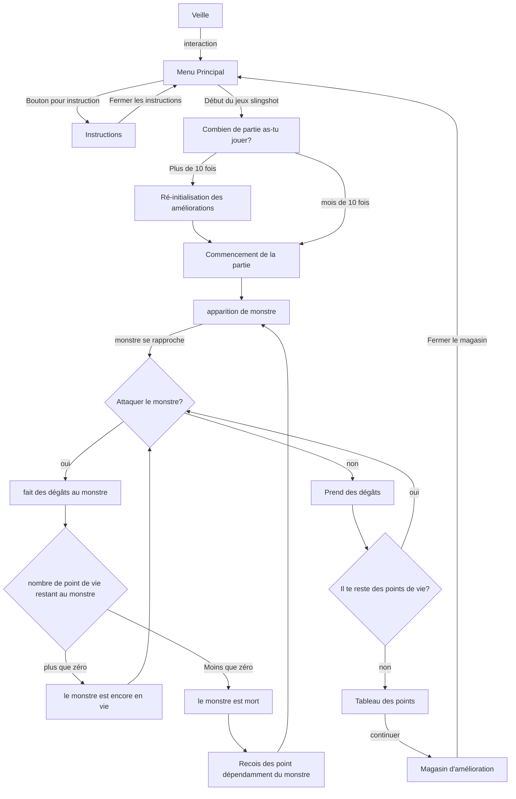

```mermaid
	flowchart TD
	Veille[Veille] --> |interaction| MainMenu[Menu Principal]
	MainMenu --> |Bouton pour instruction| Instructions[Instructions]
	Instructions --> |Fermer les instructions| MainMenu
	MainMenu --> |Début du jeux slingshot| GameCounter[Combien de partie as-tu jouer?]
	GameCounter --> |Plus de 10 fois| ResetGame[Ré-initialisation des améliorations]
	ResetGame --> DébutJeux
	GameCounter --> |mois de 10 fois| DébutJeux[Commencement de la partie]

	DébutJeux --> SpawnMonster[apparition de monstre]
	SpawnMonster --> |monstre se rapproche| AttackMonster{Attaquer le monstre?}

	AttackMonster --> |oui| DamageMonster[fait des dégâts au monstre]
	DamageMonster --> MonsterHP{nombre de point de vie restant au monstre}
	MonsterHP --> |plus que zéro| MonsterAlive[le monstre est encore en vie]
	MonsterHP --> |Moins que zéro| MonsterDead[le monstre est mort]
	MonsterAlive --> AttackMonster
	MonsterDead --> GetPoint[Recois des point dépendamment du monstre]
	GetPoint --> SpawnMonster
	

	AttackMonster --> |non| TakeDamage[Prend des dégâts]
	TakeDamage --> HPStatus{Il te reste des points de vie?}
	HPStatus --> |oui| AttackMonster
	HPStatus --> |non| ScoreBoard[Tableau des points]

	ScoreBoard --> |continuer| RogueLikeShop[Magasin d'amélioration]
	RogueLikeShop --> |Fermer le magasin| MainMenu

	
```
	
