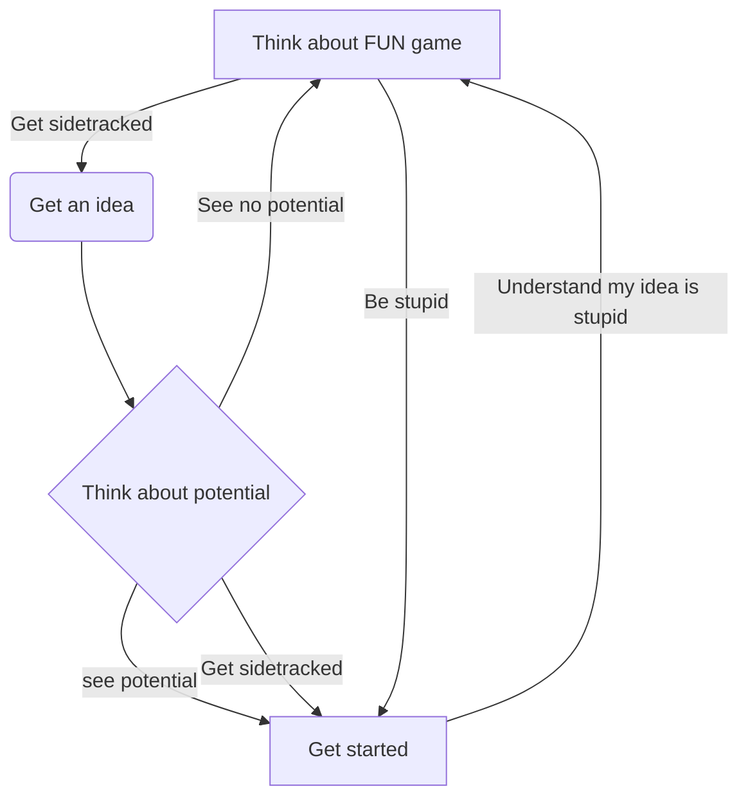

```mermaid
flowchart TD
    A[Think about FUN game] -->|Get sidetracked| B(Get an idea)
    B --> C{Think about potential}
    C -->|see potential| D[Get started]
    C -->|See no potential| A
    C -->|Get sidetracked| D
    D -->|Understand my idea is stupid| A
    A -->|Be stupid| D
```
