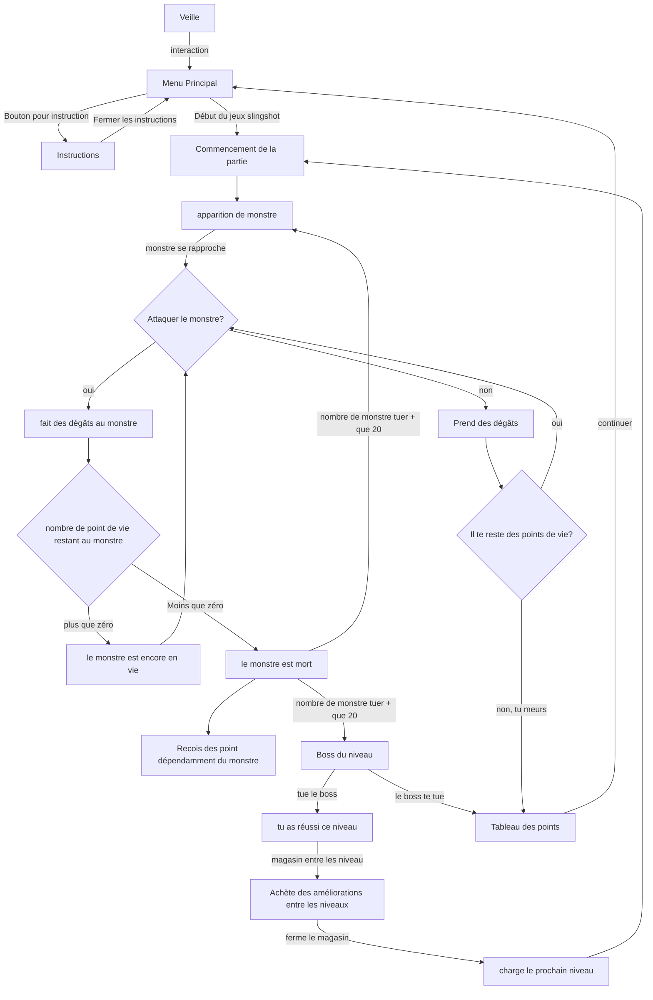
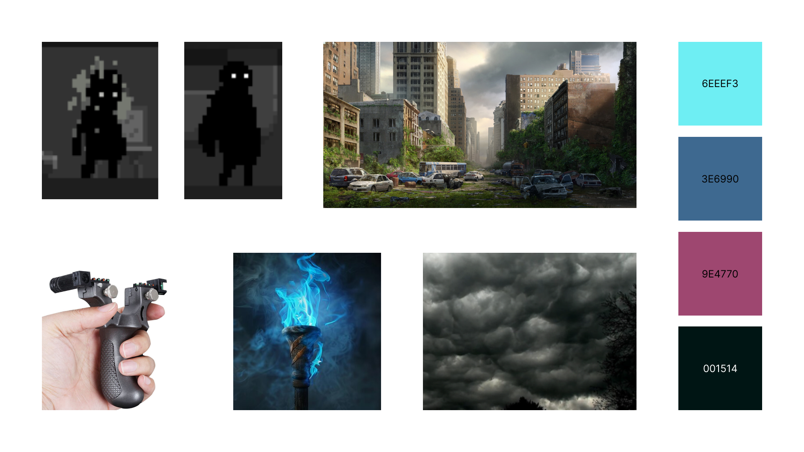
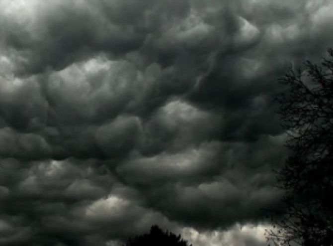
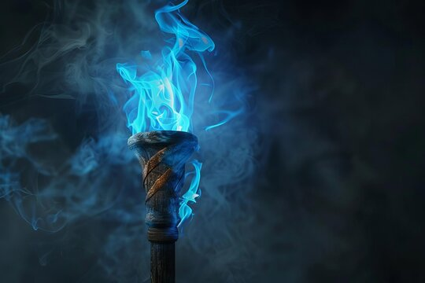
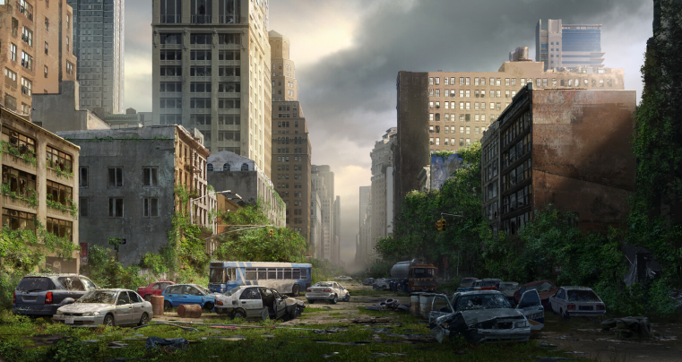
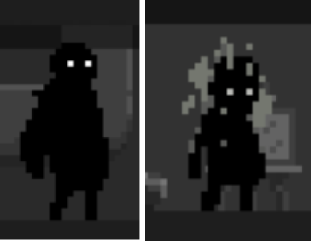

# idée 

## pitch

Le joueur incarne un survivant dans un monde post-apocalyptique où il doit se battre contre des monstres pour survivre. Armé d'un lance-pierre avec un viseur laser, le joueur navigue à travers plusieurs niveaux et il se bat contre des ennemis de plus en plus puissant. Entre chaques niveaux le joueur peut acheter des améliorations avant de continuer.

Le joueur aurait un lance-pierre dans les mains avec un pointeur laser pour viser. La bande servirait comme détecteur de tir. Pour des raisons sécuritaires, le joueur ne va pas avoir de vrai balle.

# scenar

# moodboard

ambiance, sons, etc

# technologie
	
matériaux

logiciel
