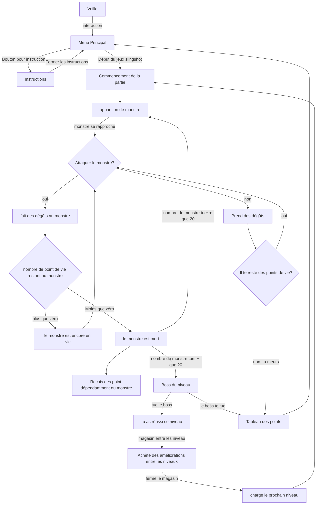

# Shadow-Sling

# idée 

## Pitch

Le joueur incarne un survivant dans un monde postapocalyptique où il doit se battre contre des monstres pour survivre. Armé d'un lance-pierre avec un viseur laser, le joueur navigue à travers plusieurs niveaux et il se bat contre des ennemis de plus en plus puissants. Entre chaque niveau le joueur peut acheter des améliorations avant de continuer.

Le joueur aurait un lance-pierre dans les mains avec un pointeur laser pour viser. La bande servirait comme détecteur de tir. Pour des raisons sécuritaires, le joueur ne va pas avoir de vrai balle.

## Scénario interactif

## Moodboard

### Moodboard d'ambiance

crédit pour images:  
Nuages: [Metlink](https://www.metlink.org/experiment/why-do-clouds-look-black/)   
Torche: [Adobe](https://stock.adobe.com/)   
Ville: [Archdaily](https://www.archdaily.com/998267/architecture-after-civilization-design-in-the-post-apocalypse)   
Monstre: [The Final Station (jeu vidéo)](https://thefinalstation.com/)  
Lance-Pierre: [Pro-Green](https://www.pro-greens.com/hunting-professional-catapult-laser-slingshot-with-rubber-aim-point-target-hot-RURDGElAVhlXRVJV)

***
#### Lance-pierre

Le lance-pierre sera l'arme principale du joueur. Il le tiendra dans ses main pour viser sur la projection sur un mur.

#### Nuages

Il y aurait des nuages noir épais avec des éclairs pour rajouter a l'ambiance.

#### Torche bleu

Le joueur possèderait une lanterne bleue pour repousser la noirceur. La lampe agirait aussi comme compteur de point de vie.

#### Ville apocalyptique

Le jeu se passerait dans une ville en ruine avec plusieurs environnements selon le niveau. Il va aussi y avoir un décor de magasin entre les niveaux.

#### Monstres

Les monstres sont des ombres ressemblant à ceux dans la photo. Ils seront faits d'une fumée noire avec de la lumière mauve sombre a l'intérieur. Si possible, il va y avoir plusieurs types de monstres.

#### couleurs

J'ai choisi un thème de couleur plus sombre et plus froide pour venir augmenter l'ambiance d'apocalypse. De plus, ces couleurs viennent aider la détection du laser, car ils feront ressortir le rouge plus facilement.

### Moodboard de sons

#### ambiance de base

[Vent et tonnerre](https://www.soundeffectsplus.com/product/storm-wind-and-thunder-01/)

[pluie légère](https://soundbible.com/2011-Rain-Background.html)

Mélange des deux pour faire une ambiance tendue.

#### Monstres

[Bruit de vieille radio](https://www.soundeffectsplus.com/product/antique-tube-radio-being-tuned-02/)

[Bruit de pas dans une forêt](https://www.soundeffectsplus.com/product/footsteps-walking-in-forest-01/)

Faible bruit provenant des monstres avec des bruits de pas occasionnel.

#### Lance-Pierre

[Élastique cartoon](https://pixabay.com/sound-effects/slingshot-1-40486/)

[Arc](https://soundbible.com/1780-Bow-Fire-Arrow.html)

Un bruit d'élastique, mais un peu moins cartoon. Il jouerait lorsque le joueur tire sur la bande.

#### Torche

[Bruit de feu](https://soundbible.com/1543-Fireplace.html)

Bruit de feu irrégulier qui s'affaiblit selon la vie restante du joueur.

## technologie

### Support médiatique

Une application créée dans unité qui sera projetée sur un mur par un projecteur. Une caméra filmera cette projection pour capter la position de la couleur rouge (le laser). Quand la bande du lance-pierre sera relâchée, un message sera envoyé vers l'application pour "tirer" sur la position du point rouge. Des haut-parleurs des 2 côtés de la projection créeront une ambiance stéréo qui différera selon l'action du joueur.

### Matériaux

Un capteur pour quand la bande du lance-pierre dépasse le centre du lance-pierre après avoir été tiré.  

Un système de projection.  
Un système de tracking pour la couleur rouge.  
Model 3D créé par imprimante 3D

### Logiciel

Unity pour la création de l'application  
Visual studio pour la programmation d’unité  
Maya ou Blender (pour la création du lance-pierre)  
