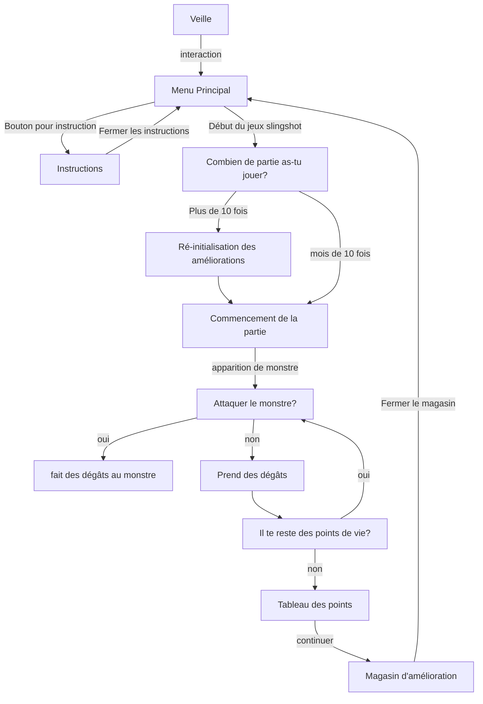

```mermaid
	flowchart TD
	Veille[Veille] --> |interaction| MainMenu[Menu Principal]
	MainMenu --> |Bouton pour instruction| Instructions[Instructions]
	Instructions --> |Fermer les instructions| MainMenu
	MainMenu --> |Début du jeux slingshot| GameCounter[Combien de partie as-tu jouer?]
	GameCounter --> |Plus de 10 fois| ResetGame[Ré-initialisation des améliorations]
	ResetGame --> DébutJeux
	GameCounter --> |mois de 10 fois| DébutJeux[Commencement de la partie]
	DébutJeux --> |apparition de monstre| AttackMonster[Attaquer le monstre?]
	AttackMonster --> |oui| DamageMonster[fait des dégâts au monstre]
	AttackMonster --> |non| TakeDamage[Prend des dégâts]
	TakeDamage --> HPStatus[Il te reste des points de vie?]
	HPStatus --> |oui| AttackMonster
	HPStatus --> |non| ScoreBoard[Tableau des points]
	ScoreBoard --> |continuer| RogueLikeShop[Magasin d'amélioration]
	RogueLikeShop --> |Fermer le magasin| MainMenu
```
	
